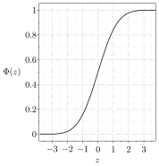

# Styling Maple graphics with Ti*k*Z and LaTeX

This repository holds digital assets associated with the article "Styling Maple
graphics with Ti*k*Z and LaTeX" [[1](#references)]. That article discusses
using Ti*k*Z and LaTeX to style graphics produced by the Maple mathematics
software package. A graph of the standard cumulative distribution function was
used to demonstrate the technique.

 
<table>
<tr>
<td width="58%">
<figure>
  

  <picture>
    <source media="(prefers-color-scheme: dark)" srcset="assets/standard-normal-cumulative-distribution-graph-dm.svg">
    
  </picture>
  

</figure>
</td>
<td width="41%">
Figure 1. The standard normal cumulative distribution function Φ(<i>z</i>). Maple-generated: graph body. Ti<i>k</i>Z and LaTeX-generated: axes, bounding box, tickmarks and text. Adapted from [<a href="#references">1</a>].
</td>
</tr>
</table>

## Table of Contents

- [Key Files](#key-files)
- [Supplementary Files](#supplementary-files)
- [Software Requirements](#software-requirements)
- [Quality Assurance](#quality-assurance)
- [Getting Started](#getting-started)
- [Next Steps](#next-steps)
- [References](#references)

## Key Files

| File                              | Notes            |
| :-------------------------------- | :--------------- |
| `src/graph-maple-distribution.mw` | Maple worksheet. |
| `src/graph-tikz-styler.tex`       | LaTeX document.  |

## Supplementary Files

| File                                       | Notes                                         |
| :----------------------------------------- | :-------------------------------------------- |
| `out/graph-example-maple-bare-input.pdf`   | Example input bare Maple graph.               |
| `out/graph-example-tikz-styled-output.pdf` | Example output Ti*k*Z and LaTeX-styled graph. |
| `src/graph-maple-distribution.txt`         | Plain text version of the Maple code.         |

## Software Requirements

| Software                              | Notes                                                                                                                                                                                                                                                                                                                |
| :------------------------------------ | :------------------------------------------------------------------------------------------------------------------------------------------------------------------------------------------------------------------------------------------------------------------------------------------------------------------- |
| LaTeX                                 | [Available here](https://www.latex-project.org). Free.                                                                                                                                                                                                                                                               |
| Maple                                 | [Available here](https://www.maplesoft.com). Proprietary.                                                                                                                                                                                                                                                            |
| epstopdf &nbsp;                    | [Details here](https://tug.org/epstopdf/). Free. &nbsp;&nbsp;&nbsp;Optional. Called from Maple for PDF cropping.                                                                                                                                                                                                  |
| pdfcrop &nbsp; &nbsp;           | Free. &nbsp;&nbsp;&nbsp;Optional. Called from Maple for PDF cropping. &nbsp;&nbsp;&nbsp;TeX distributions: available in MiKTeX and TeX Live packages.                                                                                                                                                          |
| pdftops &nbsp; &nbsp; &nbsp; | Free. &nbsp;&nbsp;&nbsp;Optional. Called from Maple for PDF cropping. &nbsp;&nbsp;&nbsp;Linux, macOS: included in poppler-utils or [Xpdf](https://www.xpdfreader.com/). &nbsp;&nbsp;&nbsp;Windows: included in poppler-utils, [Xpdf](https://www.xpdfreader.com/) or the MiKTeX package miktex-poppler-bin. |
| Ghostscript &nbsp; &nbsp;       | [Available here](https://www.perl.org/). Free. &nbsp;&nbsp;&nbsp;Optional. pdfcrop depends on it. &nbsp;&nbsp;&nbsp;TeX distributions: included in [MiKTeX](https://miktex.org/) on Windows and [MacTeX](https://www.tug.org/mactex/).                                                                         |
| Perl &nbsp; &nbsp; &nbsp;    | [Available here](https://www.perl.org/). Free. &nbsp;&nbsp;&nbsp;Optional. pdfcrop depends on it. &nbsp;&nbsp;&nbsp;TeX distributions: included in [TeX Live](https://www.tug.org/texlive/). &nbsp;&nbsp;&nbsp;Linux, macOS: included in most systems.                                                      |

### LaTeX Configuration

Please ensure the LaTeX environment has the following packages installed:

- standalone.
- tikz.

## Quality Assurance

The Maple code has been tested in the following environment.

Maple: Windows Test Environment

 

| Type     | Component        | Version                           |
| :------- | :--------------- | :-------------------------------- |
| Platform | Operating system | Windows 11, 24H2                  |
| Software | Maple            | 2025.1                            |
| &quot;   | Perl             | Strawberry Perl (64-bit) 5.40.2.1 |

The LaTeX code has been tested in the following environment.

LaTeX: Windows Test Environment

 

| Type          | Component        | Version                                |
| :------------ | :--------------- | :------------------------------------- |
| Platform      | Operating system | Windows 11, 25H2 (OS Build 26200.8973) |
| Software      | MiKTeX           | 26.5                                   |
| LaTeX package | standalone       | 1.5a                                   |
| &quot;        | tikz             | 3.1.11a                                |

## Getting Started

### Maple Graphics

The Maple worksheet should be run in Maple.

The worksheet graphs the standard normal cumulative distribution function. In
addition to default Maple output, a bare version with the graph body but no
text or axes, is output. The bare graph is used during Ti*k*Z styling,
discussed below.

For users without Maple:

- A plain text version of the Maple code is [available here](src/graph-maple-distribution.txt).
- A pre-generated bare Maple graph is [available here](out/graph-example-maple-bare-input.pdf).

### Ti*k*Z Styling

The LaTeX document `graph-tikz-styler.tex` holds the file path to a
Maple-generated bare graph to import. That file path, at line 15, should be
updated to match your desired target bare graph. The pre-generated graph
`graph-example-maple-bare-input.pdf` may be used for testing.

The LaTeX document `graph-tikz-styler.tex` should then be compiled. Graph text
and axes will be reconstructed by Ti*k*Z, overriding Maple's styling.

For users without Ti*k*Z and LaTeX, a pre-generated example Ti*k*Z-styled graph
is [available here](out/graph-example-tikz-styled-output.pdf).

## Next Steps

This repository, and the associated article, give an example of how to style
Maple graphics with Ti*k*Z and LaTeX.

The code handles a specific example graph. Users are encouraged to modify it
for their own Maple graphics.

## References

1. T. Stenborg, "Styling Maple graphics with Ti*k*Z and LaTeX", <i>TUGboat</i>,
   vol. 46, no. 3, pp. 379&ndash;380, Oct. 2025, doi:
   10.47397/tb/46-3/tb144stenborg-maple.\
   [View PDF](https://tug.org/TUGboat/tb46-3/tb144stenborg-maple.pdf) &nbsp;
   [View at publisher](https://tug.org/TUGboat/tb46-3/tb144stenborg-maple.html)
   &nbsp; [SciX](https://scixplorer.org/abs/2025TUGbt..46..379S/abstract)
